# UrbanMirror Digital Twin Platform

## Overview

UrbanMirror is a comprehensive digital twin platform designed for smart city infrastructure management. It creates virtual representations of physical urban systems, enabling real-time monitoring, predictive analytics, and intelligent decision-making for city operations.

## What is a Digital Twin?

A digital twin is a virtual replica of a physical system that continuously receives data from its real-world counterpart. In our smart city context, the digital twin mirrors the behavior, status, and characteristics of urban infrastructure components like traffic systems, environmental sensors, energy grids, and public facilities.

## Architecture

The platform follows a modular, microservices-based architecture organized into distinct layers:

### Edge Infrastructure Layer
- **IoT Sensors**: Physical devices deployed throughout the city
- **Device Simulator**: Virtual sensors for testing and development
- **Edge Gateway**: Local processing and data aggregation point

### Message Processing Layer
- **Message Broker**: Handles asynchronous communication between components
- **Protocol Adapter**: Translates various IoT protocols (MQTT, CoAP, HTTP)
- **IoT Agent**: Manages device connectivity and data transformation

### Core Services Layer
- **Context Broker**: Central hub managing the digital twin state
- **Authentication Service**: Secure access control and identity management
- **Configuration Manager**: Dynamic system configuration and deployment

### Data Management Layer
- **Real-time Store**: Immediate access to current system state
- **Cache Layer**: High-performance data access optimization
- **Data Processor**: Real-time analytics and event processing
- **Analytics Store**: Historical data warehouse for trend analysis

### Application Layer
- **Load Balancer**: Distributes traffic across service instances
- **API Gateway**: Unified entry point for external applications